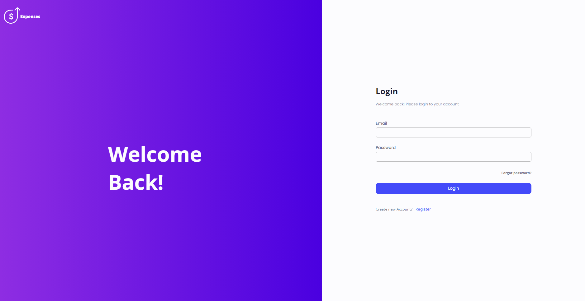
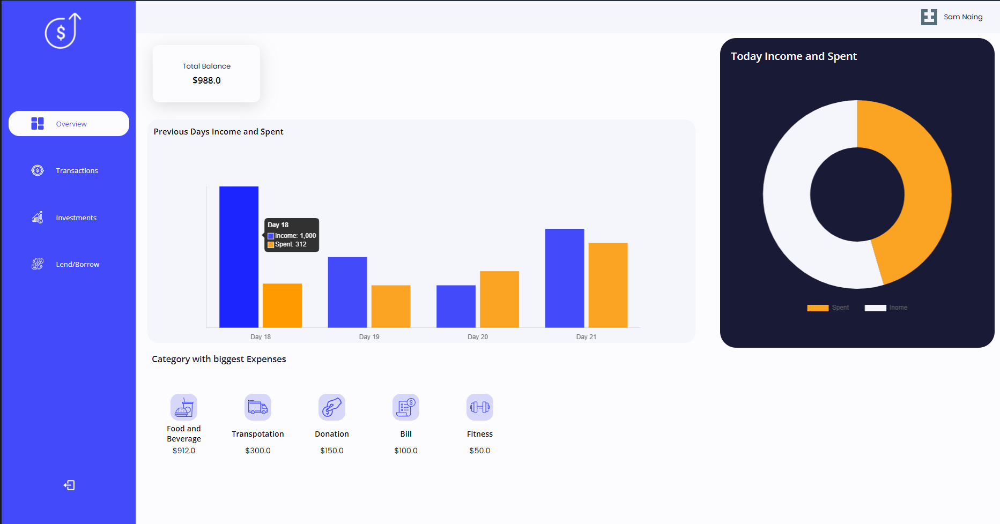
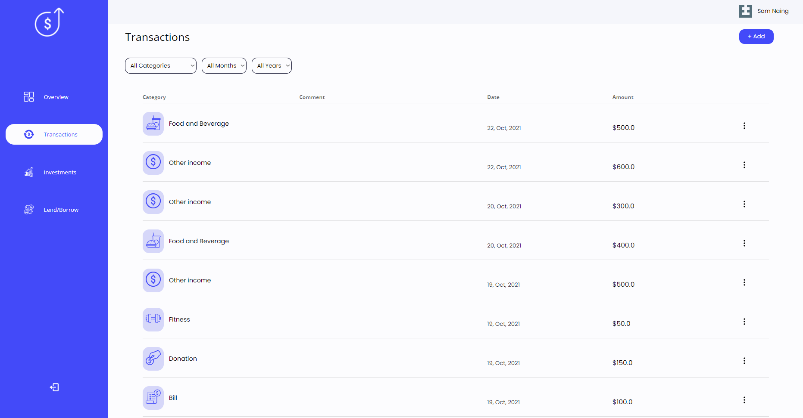
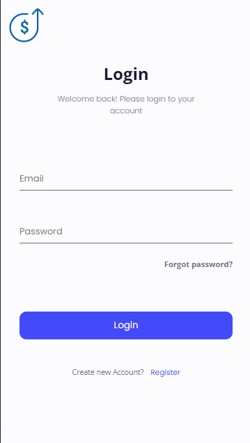
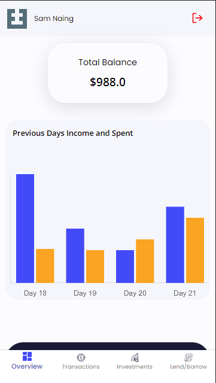
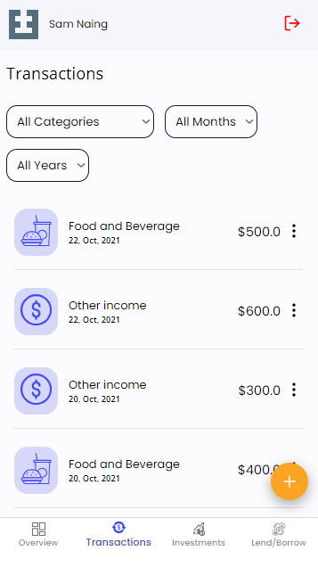

## Expenses (Expense Tracker)

This application is build to track user's daily income and expenses.

## Project Screen Shots

## Reflection

This is my second react project. I use React, Typescript, Scss and Material UI for frontend and Express and MongoDB for backend. During this project, I’ve learned a lot about React and MongoDB.

I wanted to add a month and year filter for users to filter and find the data they want. I realized that the mongodb “find” method will not work with month and year filtering. So, I did some research and found out about data aggregation. I learned about data aggregation and how it's done using mongoose and used it in this project.

Pagination is a powerful feature. I use IntersectionObserver class in react application to check whether a user has reached the bottom of the scroll to perform pagination and for backend I found an article on Medium website about how to perform mongodb data pagination efficiently using data aggregation and I implemented it.

I use both responsive design and adaptive design so the website looks good on any device. I use material ui for mobile view design to speed up my development.

For state management I use Redux toolkit over plain redux. In plain redux, I have to declare unique strings for each action but in redux toolkit I just need to declare functions.

My overall experience building this project was amazing. I came across many errors and bugs but somehow I managed to find solutions for those errors from stackoverflow and github.
